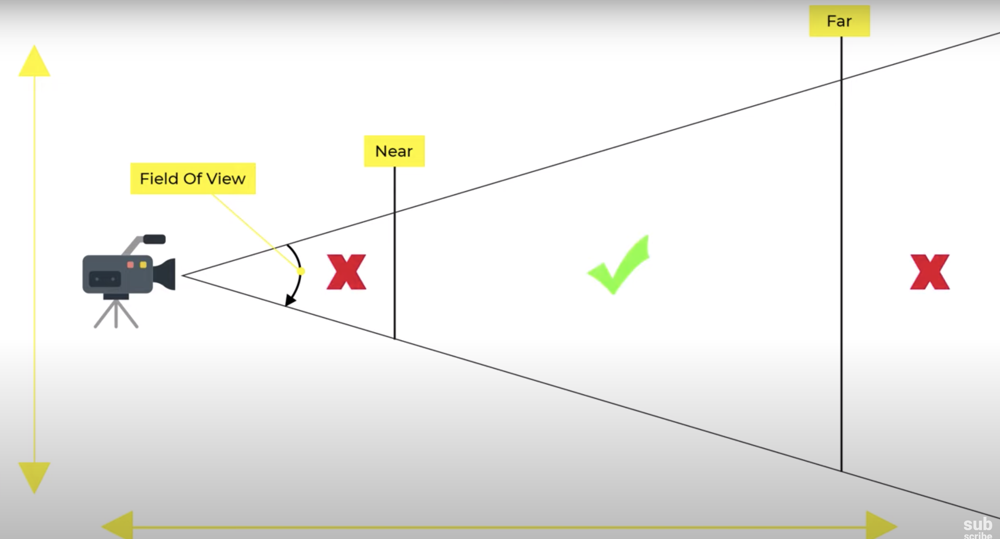
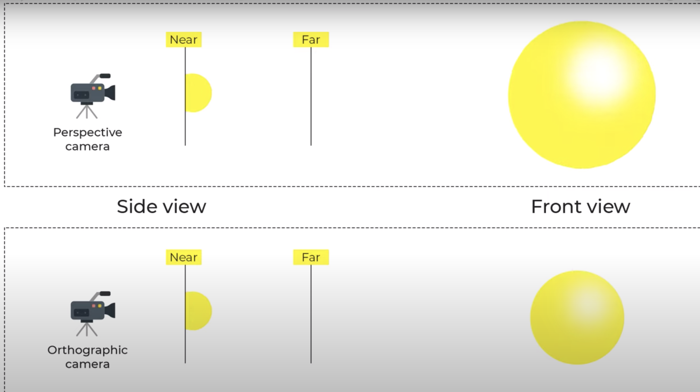
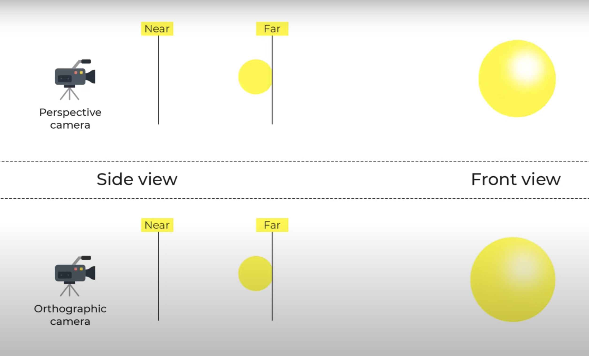

Reference #LINK - https://www.youtube.com/watch?v=xJAfLdUgdc4&list=PLjcjAqAnHd1EIxV4FSZIiJZvsdrBc1Xho

Three important things to render anything in ThreeJs:
1. Scene
2. Camera
3. Renderer

# Camera

## PerspectiveCamera

Pictorial representation of attributes:

const camera = new THREE.PerspectiveCamera( 75, window.innerWidth / window.innerHeight, 0.1, 1000 );

-> 1st attribute: Field of view(FOV), extent of the scene that is seen on the display at the moment. Value is in degree

-> 2nd attribute: Aspect ratio of the object

-> 3rd, 4th: Near and far clipping plane. Objects > far && Objects < near won't be rendered

## Orthographic camera

It is used to render 2D objects

Perspective camera Vs Orthographic camera

# Renderer

To set the size at which we want renderer to render our app

const renderer = new THREE.WebGLRenderer();
renderer.setSize( window.innerWidth, window.innerHeight );

If you wish to keep the size of your app but render it at a lower resolution, you can do so by calling setSize with false as updateStyle (the third argument).

For example:
setSize(window.innerWidth/2, window.innerHeight/2, false)

This will render your app at half resolution, given that your <canvas> has 100% width and height.

# Create a cube

Steps:
1. Create a geometric object
2. Add material(e.g. color) to it
3. Using Mesh, apply material on object
4. Add object to scene

By default, all the things will be added at the same co-ordinates (0,0,0).

5. That's why move camera a bit

# Rendering the scene

function animate() {
	renderer.render( scene, camera );
}
renderer.setAnimationLoop( animate );

This will create a loop that causes the renderer to draw the scene every time the screen is refreshed (on a typical screen this means 60 times per second). If you're new to writing games in the browser, you might say "why don't we just create a setInterval ?" The thing is - we could, but requestAnimationFrame which is internally used in WebGLRenderer has a number of advantages. Perhaps the most important one is that it pauses when the user navigates to another browser tab, hence not wasting their precious processing power and battery life.

# WebGL compatibility check
Even though this is becoming less and less of a problem, some devices or browsers may still not support WebGL 2.
Refer to check WebGL compatibility: https://threejs.org/docs/index.html#manual/en/introduction/WebGL-compatibility-check

# Lights

## Ambient light
It is the environmental ligh that comes from all directions
e.g. Room light

## Directional light
That comes from a particular direction
e.g. Sunlight

## Spot light
Emits the light in the form of a cone